# DomainOS

[](LICENSE)
[](#security--privacy)
[](#security--privacy)
[](#multi-provider-llm-support)
[](LICENSE)
[](#project-status)
[](ROADMAP.md)
[](https://github.com/quiet-coder-io/DomainOS/discussions)
[](https://github.com/quiet-coder-io/DomainOS)

**In an ever-evolving business environment, the challenge isn't a lack of information — it's drowning in it. DomainOS is your second brain — a centralized mission control space that absorbs everything you know across every domain you manage and makes it work for you. You feed it the raw material: documents, correspondence, financials, legal filings, transcripts. It remembers what you can't, connects what you wouldn't, and surfaces what matters when it matters. When it's time to act, your second brain produces the outputs you actually need: response emails in your voice, negotiation playbooks backed by evidence, risk assessments with auditable trails, and strategic guidance grounded in your own knowledge base. Every insight is traceable. Every decision leaves a trail. Every domain stays in sync. Not a chatbot. Not a dashboard. A governed second brain for the owner of information who makes real decisions with real consequences.**

<p align="center">
  
</p>

---

## Download

Get the latest release for macOS:

| Mac type | Download |
|----------|----------|
| Apple Silicon (M1/M2/M3/M4) | [Download arm64 DMG](https://github.com/quiet-coder-io/DomainOS/releases/latest) |
| Intel | [Download x64 DMG](https://github.com/quiet-coder-io/DomainOS/releases/latest) |

Or browse all versions on the [Releases page](https://github.com/quiet-coder-io/DomainOS/releases).

**Install:** Open the DMG, drag DomainOS to Applications. On first launch, right-click the app → **Open** → click **Open** in the dialog (one-time step for unsigned apps). After that, it opens normally. The app checks for updates automatically.

## Project Status

> **Early alpha.** Architecture is stabilizing. The API surface may change between commits. Contributions welcome — see [CONTRIBUTING.md](CONTRIBUTING.md).

## Why DomainOS?

- **Context separation** — each professional domain gets its own AI assistant, knowledge base, and behavioral protocols. No cross-contamination.
- **Per-domain model selection** — choose Anthropic, OpenAI, or local Ollama models independently for each domain.
- **Local-first architecture** — SQLite database, filesystem KB, OS keychain for secrets. Nothing leaves your machine unless you send a chat message.
- **Privacy by default** — zero telemetry, no cloud backend, bring-your-own-key. Ollama runs entirely on-device.

## The Problem

If you manage multiple professional domains — real estate portfolios, businesses, investment accounts, legal matters — you already know the pain:

- **Context is scattered.** Each domain has its own documents, deadlines, contacts, and decision history spread across folders, emails, spreadsheets, and your memory.
- **AI tools don't understand your world.** General-purpose chatbots start from zero every conversation. They don't know your portfolio, your contracts, or what you decided last month and why.
- **Cloud tools want your data.** Most AI-powered tools require uploading sensitive business documents, financial records, and API keys to someone else's servers. For professionals handling confidential information, that's a non-starter.
- **No safety rails.** When AI makes decisions about your business, there's no audit trail, no escalation when stakes are high, and no way to catch knowledge gaps before they become costly mistakes.

## The Solution

DomainOS gives each area of your professional life its own AI-powered operating system — with a persistent knowledge base, behavioral protocols, and governance guardrails — while keeping everything on your machine.

- **Your data stays local.** Documents in your filesystem. Database in SQLite. API keys in your OS keychain. Nothing leaves your computer unless you send a chat message to your LLM provider.
- **Your AI remembers.** Each domain maintains its own knowledge base that the AI reads, references, and proposes updates to over time. It builds context across conversations, not just within one.
- **Your AI knows when to stop.** Configurable escalation triggers cause the AI to halt and surface a red alert when it encounters high-stakes situations that need human judgment — before acting, not after.
- **Your AI is auditable.** Every KB change, decision, and session is logged. Gap flags surface what your knowledge base is missing. Decision cards track rationale and let you reject choices you disagree with.

## Features

### Core

- **Domain-scoped AI assistants** — each domain gets its own context, knowledge base, and behavioral protocols
- **Knowledge base management** — point a domain at a folder, auto-index files with tiered importance, generate digests, and track changes over time
- **AI-proposed KB updates** — the assistant analyzes conversations and proposes edits to your knowledge base files, which you review and approve
- **Composable protocols** — per-domain and shared instruction sets that define how your AI assistant behaves, with priority ordering and scope control

### Multi-Provider LLM Support

- **Three providers** — Anthropic (Claude), OpenAI (GPT-4o, o3-mini), and Ollama (local LLMs like Llama, Mistral, CodeLlama)
- **Per-domain model selection** — each domain can override the global default provider and model; one domain can use Claude while another uses GPT-4o or a local Ollama model
- **Tool-use across providers** — Gmail and Google Tasks tools and AI-proposed KB updates work with all providers via a normalized tool-use abstraction
- **Gmail & Google Tasks out of the box** — OAuth credentials are built in; just click Connect, no GCP setup required. Power users can override with their own credentials in Settings
- **Graceful tool fallback** — if a model doesn't support tool calls (common with Ollama), the system detects this automatically and falls back to plain chat with no user intervention
- **Tool capability caching** — 4-state cache (supported / not observed / not supported / unknown) avoids wasted latency on models known to lack tool support
- **Settings dialog** — manage API keys for Anthropic and OpenAI, test Ollama connections, browse installed Ollama models, probe tool support per model, optional Google OAuth credential override
- **Encrypted key storage** — per-provider API keys stored via Electron `safeStorage`, encrypted by your OS keychain; keys never reach the renderer process

### Strategic Advisory

- **Mode-classified responses** — the AI classifies each interaction as brainstorm, challenge, review, scenario, or general, and structures its output accordingly
- **Advisory artifacts** — strategic outputs (brainstorms, risk assessments, scenario analyses, strategic reviews) can be persisted to a "Strategic History" panel with schema-validated JSON fence blocks
- **Decision quality gates** — decisions include confidence level, time horizon, reversibility class, category, and authority source tier for richer audit trails
- **Advisory tools** — 4 read-only tools (`advisory_search_decisions`, `advisory_search_deadlines`, `advisory_cross_domain_context`, `advisory_risk_snapshot`) give the AI data-aware strategic reasoning
- **Cross-domain contamination guard** — cross-domain facts are labeled with source domain in tool outputs and enforced by protocol
- **Deterministic task extraction** — "Turn into tasks" converts advisory artifacts into actionable deadlines without an LLM call

### Strategic Brainstorming (BMAD Method)

- **Deep facilitated sessions** — the AI acts as a brainstorm facilitator, not just a generator, guiding you through structured creative techniques with genuine back-and-forth coaching
- **106 techniques across 10 categories** — 56 brainstorming techniques + 50 advanced elicitation methods spanning creative, analytical, strategic, disruptive, futuristic, collaborative, structured, design-thinking, lateral-thinking, and systems-thinking categories; technique data adapted from the [BMAD-METHOD](https://github.com/bmad-code-org/BMAD-METHOD) (MIT License)
- **Heuristic technique recommendations** — keyword matching and category affinity scoring suggest the most relevant techniques for your topic and goals — no LLM call required
- **Multi-round idea capture** — accumulate ideas across multiple technique rounds with automatic round management; switch techniques mid-session and the system tracks which ideas came from which round
- **Anti-bias facilitation protocol** — the AI pivots creative approaches every 10 ideas, runs energy checkpoints every 4-5 exchanges, and pushes for ideas 50-100 (the first 20 are obvious)
- **Deterministic synthesis** — when ready, a local synthesizer clusters ideas by keyword overlap and technique category, merges small clusters, ranks by size and round diversity, and produces up to 10 structured options with labels, recommendations, contrarian views, and challenged assumptions — no LLM needed for clustering
- **Session lifecycle** — start → select techniques → facilitate → pause/resume → synthesize → advisory artifact; one active session per domain, paused sessions hold the slot
- **500-idea soft cap** — sessions can accumulate up to 500 raw ideas before requiring synthesis
- **Recovery-safe** — synthesis previews are stored in the database with SHA-256 hashes, so if the LLM fence block fails, the structured output is recoverable

### Safety & Governance

- **Stop blocks** — the AI escalates to you with a red alert when it encounters situations requiring human judgment, based on configurable escalation triggers
- **Gap flag detection** — automatically identifies and surfaces knowledge gaps in your KB, with acknowledge/resolve workflow
- **Decision logging** — tracks AI decisions with rationale, downsides, revisit triggers, and linked files; reject decisions you disagree with
- **Audit trail** — full event log of KB changes, session activity, and agent actions per domain
- **Session tracking** — monitor active AI sessions with scope, model, and elapsed time

### Portfolio Health Briefing

- **Computed portfolio health** — scores each domain's health based on KB staleness, open gap flags, and cross-domain dependencies; status tiers: active, quiet, stale-risk, blocked
- **Cross-domain alerts** — automatically detects when a stale or blocked domain affects a dependent domain (e.g., a stale PCA report blocking a refinance closing)
- **LLM-powered analysis** — streams a briefing narrative from the health snapshot + KB digests, producing structured alerts, prioritized actions, and monitors
- **Analysis alerts** — LLM-generated alerts surfaced as a standalone section with severity levels, domain attribution, and supporting evidence; displayed separately from computed cross-domain alerts so you can see both what the data shows and what the AI interprets
- **Deadline management** — capture deadlines from analysis actions or create them manually; track with priority, due date, domain, and status (active / completed / snoozed / cancelled); overdue deadlines surface prominently in the briefing
- **Google Tasks integration** — OAuth PKCE connect, overdue task detection across all lists, inline editing (click title/date to edit, reschedule, add notes), complete and delete actions with optimistic UI and error recovery
- **Snapshot hashing** — detects when portfolio state has changed since the last analysis, prompting a re-run

### Automations & Triggers

- **Domain-scoped automations** — define rules per domain: "when X happens, run an AI prompt, then do Y with the result"
- **Three trigger types** — schedule (5-field cron with human-readable preview), event (intake created, KB changed, gap flag raised, deadline approaching), or manual (one-click "Run Now")
- **Three action types** — in-app toast notification, create Google Task, or draft Gmail (requires compose scope)
- **Atomic dedupe** — UNIQUE partial index on dedupe keys prevents double-fires for schedule (same minute), event (same data hash), and manual (UUID per click) triggers
- **Failure tracking** — consecutive failure streak with auto-disable at 5 failures, exponential cooldown/backoff on provider errors, "Re-enable" button to reset
- **Rate limiting** — 1/min per automation, 10/hour per domain, 30/hour global (in-memory rolling windows); manual triggers bypass rate limits
- **Privacy controls** — opt-in payload storage; when disabled, only SHA-256 hashes of prompts/responses are stored (no preview content in DB)
- **Startup catch-up** — opt-in per automation: if the app was offline when a scheduled automation should have fired, run it once on startup
- **Crash recovery** — stale pending/running runs are automatically cleaned up on engine restart
- **Prompt templates** — mustache-style `{{var}}` substitution with domain name, event type, event data, and current date
- **Run history** — expandable per-automation history showing status, duration, error codes, and timestamps
- **Starter templates** — quick-fill buttons for common patterns: "Daily Briefing → Notification", "KB Changed → Notify", "New Intake → Create Task"
- **Current scope** — the LLM receives domain name and event metadata as context; KB-aware prompts (injecting KB content into automation runs) are planned for a future release

### Cross-Domain

- **Directed domain relationships** — link domains with typed dependencies: `blocks`, `depends_on`, `informs`, `parallel`, `monitor_only`; supports reciprocal relationships with different types per direction
- **Sibling domain relationships** — lightweight link for related domains so the AI can surface cross-domain context without mixing knowledge bases
- **Browser-to-app intake pipeline** — Chrome extension with "Send to DomainOS" that extracts web content and routes it to the right domain via AI classification
- **Gmail email drag-and-drop** — drag emails directly from Gmail into the DomainOS chat panel to attach them as context for the AI; the Chrome extension injects drag handles that extract the email subject automatically, with a manual search fallback when the extension isn't installed
- **Google Tasks as AI tools** — the chat assistant can search, read, complete, update, and delete Google Tasks via tool-use, enabling conversational task management within any domain
- **KB file watching** — automatic filesystem monitoring with debounced re-scan when KB files change on disk

### Knowledge Base Vector Search (RAG)

- **Semantic search over domain KBs** — the AI receives the most relevant KB content for each user question, instead of loading files by tier priority or truncating to a digest
- **Heading-aware chunking** — markdown files are split by headings with stable content-anchored identity (SHA-256), so only changed chunks are re-embedded on re-index
- **Two embedding providers** — Ollama (default, auto-detected, fully local via `nomic-embed-text`) or OpenAI (`text-embedding-3-small`, explicit opt-in only — KB content is never sent externally without user consent)
- **MMR diversity retrieval** — cosine similarity with Maximal Marginal Relevance to avoid redundant results; same-heading and same-file penalties ensure diverse coverage
- **Structural reserve** — top structural-tier chunks (domain identity, constraints) are always appended after semantic results, ensuring the AI never loses domain context
- **Automatic indexing** — embeddings are generated on domain switch and when KB files change; dirty-flag coalescing prevents redundant re-indexing
- **In-memory cache** — embeddings cached per domain with 15-minute TTL for sub-5ms retrieval on typical domains
- **Graceful fallback** — if embeddings are unavailable (Ollama not running, no embeddings indexed), falls back to the existing tier-based KB context with no user-visible error
- **Settings UI** — toggle KB search on/off, choose search engine (Auto/Ollama/OpenAI), set model name, re-index button, per-domain embedding status

### Mission System

- **Reusable mission definitions** — define repeatable analytical workflows with parameters, methodology, and expected outputs; enable/disable per domain
- **10-step lifecycle runner** — validate inputs → check permissions → assemble context → build prompt → stream LLM → parse outputs → persist → evaluate gates → execute actions → finalize
- **Two seeded missions** — Portfolio Briefing (cross-domain health analysis) and Loan Document Review (CMBS methodology with attorney memo + risk heatmap)
- **Approval gates** — side-effect actions (deadline creation, email drafts) require explicit user approval via a gate modal before execution
- **Real Gmail draft creation** — mission outputs can generate Gmail drafts with structured content, subject lines, and recipient lists
- **Full provenance** — every run stores definition hash, prompt hash, context hash, model ID, provider, and context metadata (KB digest timestamps, domain list, prompt sizes)
- **Dynamic parameter form** — mission parameters render as a form from the definition; data-driven capabilities (methodology, output labels) make missions self-describing
- **Run history** — browse past mission runs per domain with outputs, gates, actions, and provenance details
- **Cancel support** — cancel during streaming (before run ID is known) via request ID, or by run ID after
- **Loan Document Review** — CMBS methodology prompt builder, document inventory tracking, strict fenced-block output parser for attorney memo + risk heatmap JSON

### File Attachments in Chat

- **Drag-and-drop files** — drag files from Finder onto the chat panel to attach them as context for the AI
- **Text files** — `.md`, `.ts`, `.json`, `.csv`, and 30+ other text formats read directly with encoding validation (100KB limit)
- **Binary documents** — PDF, Excel (`.xlsx`/`.xls`), and Word (`.docx`) files extracted to text server-side via `unpdf`, `xlsx`, and `mammoth` (2MB limit)
- **Budget enforcement** — 500KB total text, 200K chars total, max 20 files per message; hash-based dedup prevents re-attaching the same file
- **Privacy-first storage** — file contents are sent inline in the LLM message; only metadata (filename, size, SHA-256 hash) is persisted in chat history

### Email Attachment Extraction

- **Automatic text extraction** — when emails are attached to chat via Gmail drag-and-drop, the app automatically extracts text from PDF, Excel, and Word attachments
- **Budget limits** — 5MB/attachment, 10K chars/attachment, 5 attachments/message, 25 per thread; low-signal PDF guard skips scanned documents
- **Transparency** — skipped attachments (unsupported format, too large, extraction failed) are listed in a summary so the AI knows what it didn't see

### Skill Library

- **Reusable analytical procedures** — define structured skills (like "CMBS loan review" or "contract analysis") with step-by-step instructions that are injected into the AI's system prompt when activated
- **Per-message activation** — select a skill before sending a message; it applies to that message only and auto-clears after send, keeping conversations flexible
- **Domain-scoped selection** — skill selection is tracked per domain, so switching between domains doesn't leak skill context
- **Freeform or structured output** — skills can produce freeform responses or enforce structured JSON output with a user-defined schema
- **Tool hints** — skills can recommend specific tools (Gmail search, advisory tools, etc.) for the AI to prefer when executing the procedure
- **Import/export** — share skills as `.skill.md` files with frontmatter metadata and markdown procedures; import skills from colleagues or across machines
- **Skill library management** — full CRUD dialog with search, filter by enabled/disabled, toggle on/off, inline editing, and per-skill export
- **Protocol precedence** — skills are treated as procedures within the domain's existing protocol constraints; domain and shared protocols always take priority

## Architecture

```mermaid
graph TB
    subgraph Browser["Chrome Browser"]
        EXT["Chrome Extension<br/><i>Send to DomainOS · Gmail Drag</i>"]
    end

    subgraph Electron["Desktop App (Electron)"]
        subgraph Renderer["Renderer Process — React 19 + Tailwind CSS 4"]
            CHAT["Chat Panel"]
            SIDEBAR["Sidebar Panels<br/><small>Gap Flags · Decisions · Strategic History · Audit Log</small>"]
            BRIEFING["Portfolio Briefing<br/><small>Health · Alerts · Analysis</small>"]
            INTAKE["Intake Panel"]
            SETTINGS["Domain Settings<br/><small>Protocols · Dependencies · KB</small>"]
        end

        IPC["IPC Bridge (contextBridge)"]

        subgraph Main["Main Process — Node.js"]
            subgraph Core["@domain-os/core"]
                DOMAINS[Domains]
                KB[Knowledge Base]
                PROTOCOLS[Protocols]
                AGENTS[Agents]
                ADVISORY["Advisory<br/><small>Parser · Artifacts · Tasks</small>"]
                BRAINSTORM["Brainstorm<br/><small>Techniques · Synthesis</small>"]
                SKILLS["Skills<br/><small>Library · Import/Export</small>"]
                MISSIONS["Missions<br/><small>Runner · Gates · Actions</small>"]
                VECTORSEARCH["Vector Search<br/><small>Embeddings · RAG</small>"]
                BRIEFMOD["Briefing<br/><small>Health · Alerts</small>"]
                AUTOMATIONS["Automations<br/><small>Cron · Events · Dedupe</small>"]
                SESSIONS[Sessions]
                AUDIT[Audit Trail]
                GAPFLAGS[Gap Flags]
                DECISIONS[Decisions]
            end
            AUTOENG["Automation Engine<br/><small>Scheduler · Rate Limits · Actions</small>"]
            INTAKESVR["Intake Server<br/><small>localhost · token auth</small>"]
        end

        subgraph Storage["Local Storage"]
            SQLITE[(SQLite)]
            FS["Filesystem<br/><small>KB files</small>"]
            KEYCHAIN["OS Keychain<br/><small>API keys</small>"]
        end
    end

    subgraph LLM["LLM Providers (BYOK)"]
        ANTHROPIC["Anthropic<br/><small>Claude Sonnet · Opus</small>"]
        OPENAI["OpenAI<br/><small>GPT-4o · o3-mini</small>"]
        EMBEDDINGS["Embedding Providers<br/><small>Ollama · OpenAI</small>"]
        OLLAMA["Ollama (Local)<br/><small>Llama · Mistral · etc.</small>"]
    end

    subgraph Google["Google APIs (OAuth)"]
        GMAIL["Gmail<br/><small>Read-only</small>"]
        GTASKS["Google Tasks<br/><small>Read-write</small>"]
    end

    EXT -- "localhost" --> INTAKESVR
    Renderer -- "IPC" --> IPC --> Main
    AGENTS -- "provider factory" --> LLM
    VECTORSEARCH -- "embed" --> EMBEDDINGS
    Main -- "OAuth PKCE" --> Google
    Core --> SQLITE
    Core --> FS
    Core --> KEYCHAIN
```



### Chat Workflow

```mermaid
flowchart LR
    A["User sends<br/>message"] --> B["Build prompt<br/><small>KB digest + protocols<br/>+ domain identity</small>"]
    B --> C["LLM generates<br/>response"]
    C --> D{Response<br/>contains?}
    D -- "Stop block" --> E["🛑 Stop Alert<br/><small>Human approval required</small>"]
    D -- "Gap flag" --> F["⚠️ Gap Flag<br/><small>KB gap detected</small>"]
    D -- "Decision" --> G["📋 Decision Card<br/><small>Logged with rationale</small>"]
    D -- "Advisory block" --> G2["🎯 Advisory Artifact<br/><small>Persisted to Strategic History</small>"]
    D -- "KB proposal" --> H["📝 KB Update<br/><small>User reviews & approves</small>"]
    D -- "Content" --> I["💬 Chat response"]
    H -- "Approved" --> J["Update KB files"]
```



### Browser Intake Pipeline


### Gmail Email Drag-and-Drop

```mermaid
flowchart LR
    A["Gmail inbox"] --> B["Drag ☰ handle<br/><small>Extension content script</small>"]
    B -- "subject in URL param" --> C["Drop on chat panel"]
    C --> D["Gmail API search<br/><small>Find email by subject</small>"]
    D --> E["Preview card<br/><small>Subject · sender · snippet</small>"]
    E --> F["Attach to<br/>chat message"]
```



## Tech Stack

| Layer | Technology |
|-------|-----------|
| Desktop shell | Electron |
| UI framework | React 19 |
| Styling | Tailwind CSS 4 |
| State management | Zustand |
| Build system | electron-vite (Vite-based) |
| Core library | TypeScript, framework-agnostic |
| LLM providers | Anthropic SDK, OpenAI SDK (also used for Ollama via OpenAI-compatible API) |
| Google APIs | Gmail (read-only), Google Tasks (read-write) via OAuth PKCE |
| Embeddings | Ollama (nomic-embed-text, local) or OpenAI (text-embedding-3-small, opt-in) |
| Database | SQLite (better-sqlite3) |
| Validation | Zod |
| Package management | npm workspaces |

## Quick Start

**Just want to use DomainOS?** Download the latest DMG from the [Download section](#download) above — no build tools needed.

**Want to develop?** Requires Node.js >= 22, npm:

```bash
git clone https://github.com/quiet-coder-io/DomainOS.git
cd DomainOS
npm install
npm run dev
```

No cloud backend required. The app runs entirely on your machine.

### Chrome Extension (Optional)

The DomainOS Chrome extension adds two capabilities: web content intake ("Send to DomainOS") and Gmail email drag-and-drop.

1. Open `chrome://extensions/` in Chrome
2. Enable **Developer mode** (top-right toggle)
3. Click **Load unpacked** and select the `extensions/chrome-dominos/` directory
4. Click the extension icon and enter your DomainOS auth token (shown in the app sidebar)

**Gmail drag-and-drop:** After installing the extension, hover over any email row in Gmail to see a blue ☰ drag handle on the left. Drag it to the DomainOS chat panel to attach the email as context for the AI. The extension automatically extracts the subject and finds the email via Gmail API.

> If DomainOS is useful to you, consider giving it a [star on GitHub](https://github.com/quiet-coder-io/DomainOS) — it helps others discover the project.

## Project Structure

```
domain-os/
├── packages/
│   ├── core/                 # Framework-agnostic core library
│   │   └── src/
│   │       ├── domains/      # Domain CRUD and config
│   │       ├── kb/           # KB indexing, digests, tiering
│   │       ├── protocols/    # Per-domain and shared protocols
│   │       ├── agents/       # Multi-provider LLM (Anthropic, OpenAI, Ollama), prompt builder
│   │       ├── advisory/     # Advisory parser, artifact repository, task extractor, schemas
│   │       ├── brainstorm/  # BMAD technique library, session repository, deterministic synthesizer
│   │       ├── skills/       # Skill library: schemas, repository, import/export serialization
│   │       ├── missions/     # Mission system: definitions, runner, gates, actions, output parsers
│   │       ├── loan-review/  # Loan Document Review: CMBS prompt builder, output parser
│   │       ├── automations/  # Automation schemas, cron parser, dedupe, templates, repository
│   │       ├── briefing/     # Portfolio health computation, LLM analysis, output parsing
│   │       ├── sessions/     # Session lifecycle management
│   │       ├── audit/        # Event audit trail
│   │       ├── intake/       # Browser intake classification
│   │       ├── storage/      # SQLite schema and migrations (v1–v22)
│   │       └── common/       # Result type, shared schemas
│   └── integrations/         # External service integrations (Gmail, Google Tasks)
├── apps/
│   └── desktop/              # Electron + React desktop app
│       └── src/
│           ├── main/         # Main process, IPC handlers, automation engine, intake server
│           ├── preload/      # contextBridge API surface
│           └── renderer/     # React UI
│               ├── components/  # Shared UI components
│               ├── pages/       # Route-level pages
│               └── stores/      # Zustand state management
└── extensions/               # Chrome extension (intake pipeline + Gmail drag content script)
```

## Security & Privacy

- **Local-first** — all data stored on your machine in SQLite and your filesystem. Nothing leaves your computer unless you send a chat message to your chosen LLM provider. Ollama runs entirely on your machine — no data leaves at all.
- **Bring Your Own Key** — per-provider API keys (Anthropic, OpenAI) are encrypted via Electron `safeStorage`, backed by your OS keychain (macOS Keychain, Windows DPAPI, Linux Secret Service). Ollama requires no API key. Keys never reach the renderer process.
- **No telemetry** — zero analytics, tracking, or phone-home behavior.
- **Localhost intake** — the Chrome extension communicates with the desktop app over `127.0.0.1` with token authentication. No external servers.

## Roadmap

See [ROADMAP.md](ROADMAP.md) for completed features, planned work, and future considerations.

## Community

Have questions, ideas, or want to share how you use DomainOS? Join the [Discussions](https://github.com/quiet-coder-io/DomainOS/discussions):

- **Q&A** — setup help, provider config, and troubleshooting
- **Feature Requests** — suggest and vote on new features
- **Domain Setups** — share how you configured DomainOS for your use case
- **Protocol Sharing** — exchange composable protocols and advisory configs
- **Provider Reports** — crowdsourced LLM model compatibility and tool-use results

## Contributing

Contributions are welcome! See [CONTRIBUTING.md](CONTRIBUTING.md) for setup instructions, development philosophy, PR workflow, and privacy expectations.

Looking for a place to start? Check issues labeled [`good-first-issue`](https://github.com/quiet-coder-io/DomainOS/labels/good-first-issue).

## Acknowledgments

DomainOS's strategic brainstorming engine is built on technique data adapted from the **[BMAD-METHOD](https://github.com/bmad-code-org/BMAD-METHOD)** by [bmad-code-org](https://github.com/bmad-code-org), licensed under [MIT](https://github.com/bmad-code-org/BMAD-METHOD/blob/main/LICENSE). The 106 brainstorming and elicitation techniques (56 brainstorming + 50 advanced elicitation across 10 categories) that power DomainOS's facilitated sessions originate from BMAD-METHOD's comprehensive technique library.

## License

[AGPL-3.0](LICENSE) — you can use, modify, and distribute this software, but any modified version must also be open-sourced under AGPL-3.0, including when served over a network.
