# DomainOS

[](LICENSE)
[](#security--privacy)
[](#security--privacy)
[](#multi-provider-llm-support)
[](LICENSE)

**A local-first desktop app for managing multiple professional domains with AI assistance. Supports Anthropic, OpenAI, and Ollama (local LLMs) with per-domain model selection.**

<p align="center">
  
</p>

---

## The Problem

If you manage multiple professional domains — real estate portfolios, businesses, investment accounts, legal matters — you already know the pain:

- **Context is scattered.** Each domain has its own documents, deadlines, contacts, and decision history spread across folders, emails, spreadsheets, and your memory.
- **AI tools don't understand your world.** General-purpose chatbots start from zero every conversation. They don't know your portfolio, your contracts, or what you decided last month and why.
- **Cloud tools want your data.** Most AI-powered tools require uploading sensitive business documents, financial records, and API keys to someone else's servers. For professionals handling confidential information, that's a non-starter.
- **No safety rails.** When AI makes decisions about your business, there's no audit trail, no escalation when stakes are high, and no way to catch knowledge gaps before they become costly mistakes.

## The Solution

DomainOS gives each area of your professional life its own AI-powered operating system — with a persistent knowledge base, behavioral protocols, and governance guardrails — while keeping everything on your machine.

- **Your data stays local.** Documents in your filesystem. Database in SQLite. API keys in your OS keychain. Nothing leaves your computer unless you send a chat message to your LLM provider.
- **Your AI remembers.** Each domain maintains its own knowledge base that the AI reads, references, and proposes updates to over time. It builds context across conversations, not just within one.
- **Your AI knows when to stop.** Configurable escalation triggers cause the AI to halt and surface a red alert when it encounters high-stakes situations that need human judgment — before acting, not after.
- **Your AI is auditable.** Every KB change, decision, and session is logged. Gap flags surface what your knowledge base is missing. Decision cards track rationale and let you reject choices you disagree with.

## Features

### Core

- **Domain-scoped AI assistants** — each domain gets its own context, knowledge base, and behavioral protocols
- **Knowledge base management** — point a domain at a folder, auto-index files with tiered importance, generate digests, and track changes over time
- **AI-proposed KB updates** — the assistant analyzes conversations and proposes edits to your knowledge base files, which you review and approve
- **Composable protocols** — per-domain and shared instruction sets that define how your AI assistant behaves, with priority ordering and scope control

### Multi-Provider LLM Support

- **Three providers** — Anthropic (Claude), OpenAI (GPT-4o, o3-mini), and Ollama (local LLMs like Llama, Mistral, CodeLlama)
- **Per-domain model selection** — each domain can override the global default provider and model; one domain can use Claude while another uses GPT-4o or a local Ollama model
- **Tool-use across providers** — Gmail tools and AI-proposed KB updates work with all providers via a normalized tool-use abstraction
- **Graceful tool fallback** — if a model doesn't support tool calls (common with Ollama), the system detects this automatically and falls back to plain chat with no user intervention
- **Tool capability caching** — 4-state cache (supported / not observed / not supported / unknown) avoids wasted latency on models known to lack tool support
- **Settings dialog** — manage API keys for Anthropic and OpenAI, test Ollama connections, browse installed Ollama models, probe tool support per model
- **Encrypted key storage** — per-provider API keys stored via Electron `safeStorage`, encrypted by your OS keychain; keys never reach the renderer process

### Safety & Governance

- **Stop blocks** — the AI escalates to you with a red alert when it encounters situations requiring human judgment, based on configurable escalation triggers
- **Gap flag detection** — automatically identifies and surfaces knowledge gaps in your KB, with acknowledge/resolve workflow
- **Decision logging** — tracks AI decisions with rationale, downsides, revisit triggers, and linked files; reject decisions you disagree with
- **Audit trail** — full event log of KB changes, session activity, and agent actions per domain
- **Session tracking** — monitor active AI sessions with scope, model, and elapsed time

### Cross-Domain

- **Sibling domain relationships** — link related domains so the AI can surface cross-domain context without mixing knowledge bases
- **Browser-to-app intake pipeline** — Chrome extension with "Send to DomainOS" that extracts web content and routes it to the right domain via AI classification

## Architecture

```mermaid
graph TB
    subgraph Browser["Chrome Browser"]
        EXT["Chrome Extension<br/><i>Send to DomainOS</i>"]
    end

    subgraph Electron["Desktop App (Electron)"]
        subgraph Renderer["Renderer Process — React 19 + Tailwind CSS 4"]
            CHAT["Chat Panel"]
            SIDEBAR["Sidebar Panels<br/><small>Gap Flags · Decisions · Audit Log</small>"]
            INTAKE["Intake Panel"]
            SETTINGS["Domain Settings<br/><small>Protocols · Siblings · KB</small>"]
        end

        IPC["IPC Bridge (contextBridge)"]

        subgraph Main["Main Process — Node.js"]
            subgraph Core["@domain-os/core"]
                DOMAINS[Domains]
                KB[Knowledge Base]
                PROTOCOLS[Protocols]
                AGENTS[Agents]
                SESSIONS[Sessions]
                AUDIT[Audit Trail]
                GAPFLAGS[Gap Flags]
                DECISIONS[Decisions]
            end
            INTAKESVR["Intake Server<br/><small>localhost · token auth</small>"]
        end

        subgraph Storage["Local Storage"]
            SQLITE[(SQLite)]
            FS["Filesystem<br/><small>KB files</small>"]
            KEYCHAIN["OS Keychain<br/><small>API keys</small>"]
        end
    end

    subgraph LLM["LLM Providers (BYOK)"]
        ANTHROPIC["Anthropic<br/><small>Claude Sonnet · Opus</small>"]
        OPENAI["OpenAI<br/><small>GPT-4o · o3-mini</small>"]
        OLLAMA["Ollama (Local)<br/><small>Llama · Mistral · etc.</small>"]
    end

    EXT -- "localhost" --> INTAKESVR
    Renderer -- "IPC" --> IPC --> Main
    AGENTS -- "provider factory" --> LLM
    Core --> SQLITE
    Core --> FS
    Core --> KEYCHAIN
```



### Chat Workflow

```mermaid
flowchart LR
    A["User sends<br/>message"] --> B["Build prompt<br/><small>KB digest + protocols<br/>+ domain identity</small>"]
    B --> C["LLM generates<br/>response"]
    C --> D{Response<br/>contains?}
    D -- "Stop block" --> E["🛑 Stop Alert<br/><small>Human approval required</small>"]
    D -- "Gap flag" --> F["⚠️ Gap Flag<br/><small>KB gap detected</small>"]
    D -- "Decision" --> G["📋 Decision Card<br/><small>Logged with rationale</small>"]
    D -- "KB proposal" --> H["📝 KB Update<br/><small>User reviews & approves</small>"]
    D -- "Content" --> I["💬 Chat response"]
    H -- "Approved" --> J["Update KB files"]
```



### Browser Intake Pipeline


## Tech Stack

| Layer | Technology |
|-------|-----------|
| Desktop shell | Electron |
| UI framework | React 19 |
| Styling | Tailwind CSS 4 |
| State management | Zustand |
| Build system | electron-vite (Vite-based) |
| Core library | TypeScript, framework-agnostic |
| LLM providers | Anthropic SDK, OpenAI SDK (also used for Ollama via OpenAI-compatible API) |
| Database | SQLite (better-sqlite3) |
| Validation | Zod |
| Package management | npm workspaces |

## Quick Start

```bash
# Clone and install
git clone https://github.com/quiet-coder-io/DomainOS.git
cd DomainOS
npm install

# Rebuild native modules for Electron
npx electron-rebuild -f -w better-sqlite3

# Run in development
npm run dev

# Type-check all packages
npm run typecheck

# Run tests
npm test

# Production build
npm run build
```

## Project Structure

```
domain-os/
├── packages/
│   ├── core/                 # Framework-agnostic core library
│   │   └── src/
│   │       ├── domains/      # Domain CRUD and config
│   │       ├── kb/           # KB indexing, digests, tiering
│   │       ├── protocols/    # Per-domain and shared protocols
│   │       ├── agents/       # Multi-provider LLM (Anthropic, OpenAI, Ollama), prompt builder
│   │       ├── sessions/     # Session lifecycle management
│   │       ├── audit/        # Event audit trail
│   │       ├── intake/       # Browser intake classification
│   │       ├── storage/      # SQLite schema and migrations
│   │       └── common/       # Result type, shared schemas
│   └── integrations/         # External service integrations
├── apps/
│   └── desktop/              # Electron + React desktop app
│       └── src/
│           ├── main/         # Main process, IPC handlers, intake server
│           ├── preload/      # contextBridge API surface
│           └── renderer/     # React UI
│               ├── components/  # Shared UI components
│               ├── pages/       # Route-level pages
│               └── stores/      # Zustand state management
└── extension/                # Chrome extension (intake pipeline)
```

## Security & Privacy

- **Local-first** — all data stored on your machine in SQLite and your filesystem. Nothing leaves your computer unless you send a chat message to your chosen LLM provider. Ollama runs entirely on your machine — no data leaves at all.
- **Bring Your Own Key** — per-provider API keys (Anthropic, OpenAI) are encrypted via Electron `safeStorage`, backed by your OS keychain (macOS Keychain, Windows DPAPI, Linux Secret Service). Ollama requires no API key. Keys never reach the renderer process.
- **No telemetry** — zero analytics, tracking, or phone-home behavior.
- **Localhost intake** — the Chrome extension communicates with the desktop app over `127.0.0.1` with token authentication. No external servers.

## License

MIT
